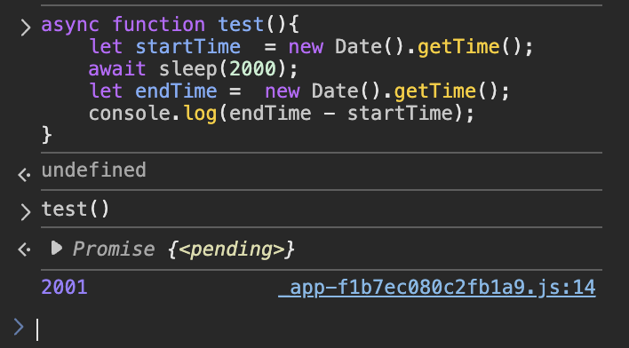

## 2621. [睡眠函数](https://leetcode.cn/problems/sleep/description/)
要求是实现一个 `sleep` 函数，使得在调用 `sleep` 函数后，程序会暂停执行指定时间，并返回一个 Promise 对象。

```js
async function sleep(millis) {
  return new Promise((resolve) => {
    setTimeout(resolve, millis);
  });
}
```

值得注意的是，`setTimeout` 并不是 `millis` 毫秒后执行，而是在 `millis` 毫秒后将回调函数加入事件队列中，等待事件循环执行。所以，传入的`millis` 应该理解为是 sleep 的最短时间，而不是刚好 `millis` 毫秒后执行。



## 2620. [计数器](https://leetcode.cn/problems/counter/description/)

给定一个整型参数 `n`，请你编写并返回一个 `counter` 函数。这个 `counter` 函数最初返回 `n`，每次调用它时会返回前一个值加 1 的值 `( n ,  n + 1 ,  n + 2 ，等等)`。
```js
const createCounter = function(n) {
    let count = n;
    return function counter() {
        return count++;
    };
};
```

通过闭包来存储 `count` 的值，每次调用时返回 `count` 的值，并将 `count` 的值加 1。
闭包的形成条件：
​- 函数嵌套：内部函数定义在外部函数内(`counter` 定义在 `createCounter` 内)。
- ​内部函数引用外部变量：内部函数使用了外部函数的局部变量或参数（`counter` 引用了外部函数的 `count` 变量）。
- ​内部函数被外部作用域调用：例如通过返回值将内部函数传递到外部 （`counter` 作为 `createCounter` 的执行结果被返回）。


## 2619 [数组原型对象的最后一个元素](https://leetcode.cn/problems/array-prototype-last/description/)

编写一段代码实现一个数组方法，使任何数组都可以调用 `array.last()` 方法，这个方法将返回数组最后一个元素。如果数组中没有元素，则返回 `-1` 。

```js
Array.prototype.last = function() {
    const length = this.length;
    if(length === 0) {
        return -1
    }
    return this[length-1]
};
```

通过 `Array.prototype` 来扩展 `Array` 对象，使得所有的数组都可以调用 `last` 方法。

1. 为什么在 `Array.prototype` 上扩展方法就可以让所有的数组都可以调用？
所有数组实例的原型链都指向 `Array.prototype` 

`Array.prototype` 是一个特殊的对象，它包含了所有数组实例所共享的属性和方法。当调用数组方法（如`push()`）时，JavaScript 引擎会优先在实例自身查找该方法，若未找到则通过 `[[Prototype]]` 向上追溯至 `Array.prototype`，所以在`Array.prototype` 上扩展的方法，使得所有数组实例都可以调用。

2. `this` 指向的问题
在 `Array.prototype` 上扩展的方法，`this` 指向的是调用该方法的数组实例。

3. `this` 指向的优先级判断


## 2618 [检查是否是类的实例对象](https://leetcode.cn/problems/check-if-object-instance-of-class/description/)
请你编写一个函数，检查给定的值是否是给定类或超类的实例。可以传递给函数的数据类型没有限制。例如，值或类可能是`undefined` 。
给的示例中有一个 case：
```
输入：func = () => checkIfInstance(5, Number)
输出：true
解释：5 是一个 Number。注意，"instanceof" 关键字将返回 false。
```
solution:
```js
var checkIfInstanceOf = function(obj, classFunction) {
    if(obj === null || obj=== undefined || classFunction === null || classFunction === undefined || !(classFunction instanceof Function)) {
        return false;
    }
    return classFunction.prototype.isPrototypeOf(Object(obj));
};
```

1. 为什么要判断 `obj` 和 `classFunction` 是否为 `null` 或 `undefined`？
在 JavaScript 中，`null` 和 `undefined` 是两种特殊的值，它们分别表示空值和未定义。在进行类型检查时，我们通常需要排除这两种情况，以避免出现错误。

2. 为什么要判断 `classFunction` 是否为 `Function` 类型？
在 JavaScript 中，`Function` 是一个内置的构造函数，它用于创建函数对象。如果 `classFunction` 不是 `Function` 类型，那么它无法作为构造函数使用，也就无法通过 `new` 关键字创建实例对象，那`obj` 就一定不是 `classFunction` 的实例对象。

   